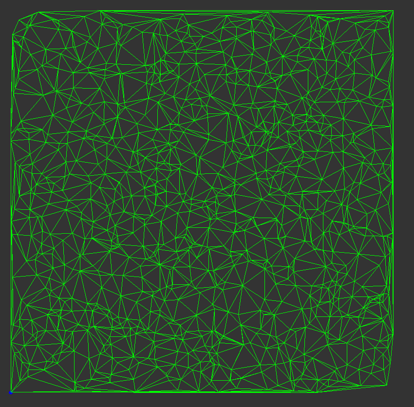
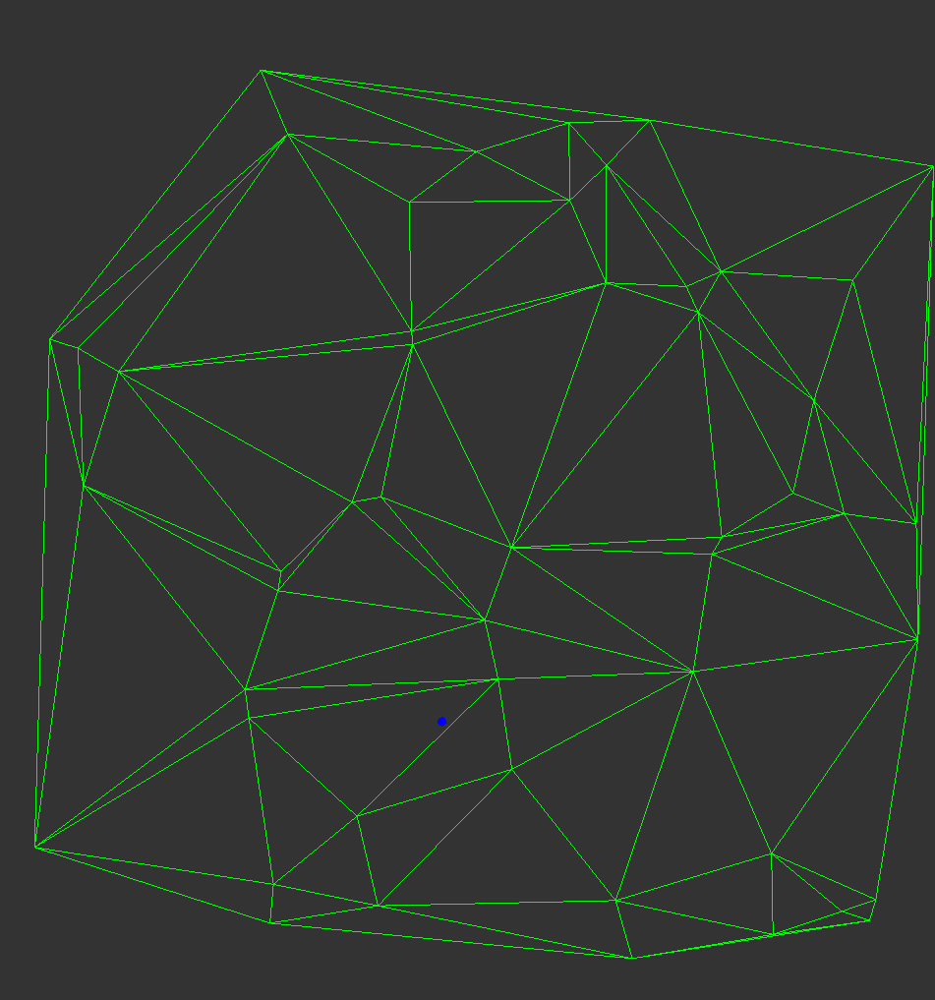

# Mesh Generation homework
Author : Rui YANG
---
## 1.GUI

There are six radio buttons and five push buttons.

### Radio buttons
- original plot : Draw the original Mesh that means 3D mesh and three colors
- connexion triangle : Draw three ajacents triangles and the center triangle
- test circulateur : Draw the center point and all the surrounding triangles
- drawwire2D : Draw 2D wire frame Mesh
- check_loc : Check location point algo
- draw_curv :Calculate Laplacian and curvature, then draw the mesh colored by curvature

### Push buttons
- Check_create_mesh : Create a primary mesh form a set of points
- flip edge : Using lawson algo for optimiser the primary mesh
- test_add_point : add a point in the delaunay mesh
- test_loc_point : Check location point algo
- exit : Exit the app

## 2.TD1

### (1) Load a file and draw the mesh 

you can change the file path here.

and the result(original plot) obtained:

### (2) Find three adjacent faces 
The aim is to find three adjacent faces for each triangle. 

<I>Instructions :</I>  
  
After load a file, you can select the button <strong>connexion triangle</strong> to show three adjacent faces of the target face  

  You can change the index of the target face here:  
  
  </img>

Here I plot three faces of the first face(index 0) of teapot: 

green : target face; red: adjacent face 

  

## 3.TD2 Circulator

The aim of this part is to crate a vertex circulator and a triangle circulator.
The vertex circulator is to traverse the surrounding faces of the target point.
The triangle circulator is to traverse the surrounding faces of the target face.

<I>Instructions :</I>  
  
After load a file, you can select the button <strong>test circulateur</strong> to show all the adjacent faces of the target point  

  You can change the index of the target point here:  
  
  </img>

Here I plot all adjacent faces of the first point(index 0) of teapot

</img>

## 4.TD3 Laplacien and Curvature

After we create the circulator, then the calculate is very simple. 
The formule we use : 

<I>Instructions :</I>  
  
After load a file, you can select the button <strong>draw_curv</strong> to calculate the laplacien and draw the mesh colored by curvature

The result we obtain : 

 
</img>

## 5.TD4 

### (1) Create a primary mesh from a set of points
Algo:
- Initialize the first triangle by using  the point with the index 0,1,2
- test for the next point : if inside the triangle then split the triangle;  if outside the point then link with the visible boundary edges;  if in the boundary then link with another vertex.
- we do this iteratively.
 

<I>Instructions :</I>  
  
You can select the button <strong>Check_create_mesh</strong> to create a primary mesh 
, I use the file <strong>franke4.off</strong> which has 1000 points.
  You can change the pathe of the data:  
  
  </img>
  
You can change the number of points used in the mesh generation process here:
(In the function <strong>void Mesh::create_mesh(const char *file_name)</strong>, you can change k<50 by another number (Here in purpose of test, I only use 50 points ))
<table>
<tr>
<td>

</td>
<td>

</td>
</tr>
</table>

  
The result we obtain (50 points and 1000 points)

<table>
<tr>
<td>

</td>
<td>

</td>
</tr>
</table>

### (2) Lawson algo for optimiser the mesh
Algo :
- Initialize a queue which contain all edges that are not local delaunay and mark all these edges(I add a property to Vertex to realize the mark)
- Then we flip these edges one by one. When we flip a edge, At first we erase the mark of the edge and then it will change the situation of four edges so we do the local delaunay test for these four edges and then add all edges without mark to the queue.
- Until the queue is empty, we finish the optimisation.

<I>Instructions :</I>  
  
After you create the mesh (select the button <strong>Check_create_mesh</strong>)
, you can select the button <strong>flip_edge</strong> to do the optimisation and then you can select <strong>drawwire2d</strong> to show the wire frame.
  

  
The result we obtain (50 points and 1000 points)

<table>
<tr>
<td>

</td>
<td>

</td>
</tr>
</table>

### (3) Add a point to a local delaunay mesh
Algo :
- find the position(the index to the triangle) of the point
- split to three and the situation of the three sides of the triangle will change, then we do the local delauny test then add to  the queue
- We flip the edge in the queue and add new edges until the queue is empty just like the lawson algo.

<I>Instructions :</I>  
  
After you create the local delaunay mesh, then you can select the button <strong>test_add_point</strong> to check the algo. 
  
  
you can change the position of the point here : 
  
  </img>
  

  
  

   
  
The result we obtain (before and After) blue point is the point added

<table>
<tr>
<td>

</td>
<td>

</td>
</tr>
</table>

